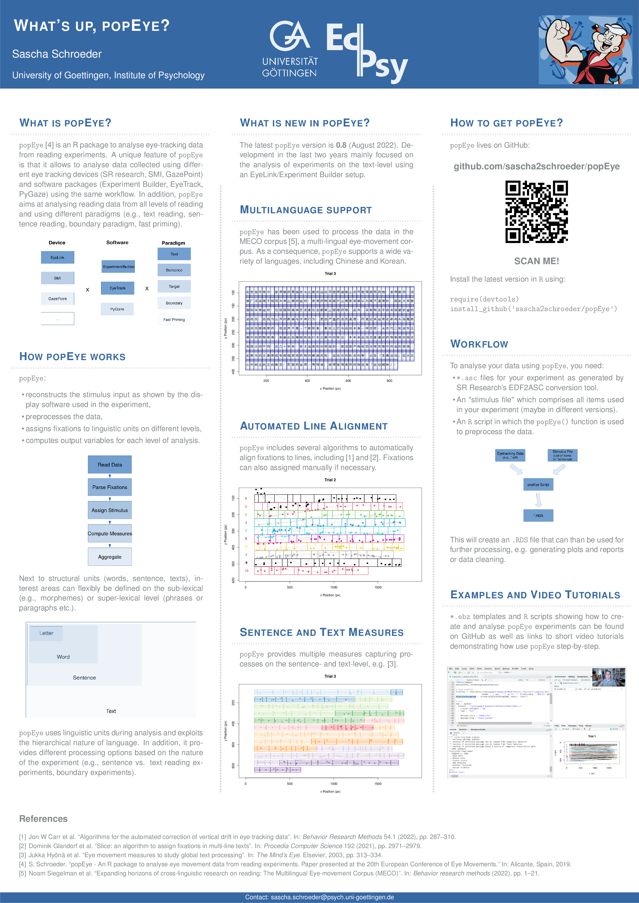

# popEye


popEye is an integrated environment to analyze eye-tracking data from reading experiments. Its unique feature is that it allows to analyze data from different experimental paradigms (single sentence reading, boundary paradigm, fast priming paradigm, text reading), collected using different eye tracking devices (SR research, SMI, etc.) and software packages (EyeTrack, Experiment Builder, etc.) within the same workflow.

<br/>
<br/>
<br/>

!!! NEW: Download the ECEM 2022 popEye poster [here](paper/ECEM_2022_popEye.pdf) !!!



popEye will be most useful to you if
- you work with different eye trackers and software packages at the same time.
- you are interested in using multi-line, multi-page texts.
- you are using boundary change and fast priming paradigms. 

Please feel free to use, test, or contribute to the package. Any help is really appreciated! The package is experimental at present, so please be patient if you encounter problems when you use popEye for the first time. Please feel free to contact me (sascha2schroeder@gmail.com) or to open an an issue on the project's github site.


## What popEye will do for you


popEye's functionaltiy can be divided in two broad areas: data preprocessing 
and data analysis.

Regarding *data preprocessing* popEye aims at substituting software packages such
SR DataViewer or EyeDoctor. The idea is that you feed your raw eyetracking and a
simple stimulus file into it and popEye outputs an R file that can be used for later analysis. 
During this process, popEye will parse the raw data into saccades and fixations,
assign fixations to lines and letters, and computes reading measures for different levels of analysis. 
It is possible to define user-specific interest areas which are flexible and can be placed within words, 
between word groups or between paragraphs.

With regard to *data analysis* the popEye file still comprises all low-level data but also 
provides separate reports for different levels of analysis (fixation report, word-
and sentence-level reports, interest-area report, text-level report). In addition, 
it has customized plots for different kinds of experiments. This helps to visualize 
your data and to identify problematic trials. Finally, popEye automatically checks 
for problematic aspects in your data (whether there was a blink before the target word, 
whether a boundary change did not complete within a change saccade, etc.). These checks
can be used to remove such trials prior to the main analysis.


## When popEye will work

The central idea of popEye is to provide a hardware- and software-independent solution
for reading-related experiments. At present, however, popEye works only with specific
eye trackers and software packages used for stimulus presentation.

- popEye currently works only for data collected using Eyelink eye trackers from SR research.
We will add support for eye trackers from other manufacturers (SMI, GazePoint, tobii) as soon as possible.

- popEye currently works only with experiments created with SR Research's 
Experiment Builder and the UMass EyeTrack package. I hope I will be able to include experiments created with PyGaze soon.

popEye supports both single- and multi-line experiments and works with 
proportional and disproportional fonts. The following fonts are currently supported although not in all font sizes:

- Arial
- Courier New 
- Consolas
- Symbol
- Tahoma
- Times New Roman

(You have to understand that each font and font size combination has to be implemented separately). 
Some special characters might still be missing which can cause problems during preprocessing. Please contact me,
if you experience any problems.
There is no general problem why popEye shouldn't work with non-European (Chinese, Arabic, Hebrew, etc.) 
and unspaced orthographies. However, it certainly needs some work to implement this. 
Please contact me, if you are interested in this.


## Installation

=======
The easiest way to install the most recent version of popEye (current version is 0.8.0, August 2022) is via the devtools package:

``` R
require(devtools)
install_github('sascha2schroeder/popEye')
```


## How should I set up my experiment so that popEye works smoothly?

There are different ways how an eye tracking experiment can be programmed. 
popEye might not work with all possible implementations. The most important thing is to send proper
messages at the start and the end of each trial and whenever important things happen during a trial 
(display changes etc.). 

A brief tutorial how to set up an experiment in Experiment Builder and an example experiment
can be found [here](materials/Setup_ExperimentBuilder.md).

Example scripts for EyeTrack can be found here for
[single line](materials/EyeTrack_SingleLine.script) and 
[multi line](materials/EyeTrack_MultiLine.script) experiments.


## Use

Some short comments about the text assignment process in `popEye`can be found [here](materials/Assign.md).


A short introduction explaining how to use popEye to preprocess your data can be found [here](materials/Preprocessing.md).

A brief tutorial how to use popEye during the analysis of your data can be found [here](materials/Analysis.md).


## References

I am currently preparing a manuscript to be submitted to Behavior Research Methods.
Meanwhile, you can reference it like this:

Schroeder, S. (2019). *popEye - An R package to analyse eye movement data from reading experiments.* GitHub repository, https://github.com/sascha2schroeder/popEye

Alternatively, you can cite the talk I gave at ECEM 2019 in Alicante:

Schroeder, S. (2019, August). *popEye - An R package to analyse eye movement data from reading experiments.* Paper presented at the 20th European Conference of Eye Movements Alicante, Spain.

The slides of the talk can be found [here](paper/ECEM_2019_popEye.pdf).

Here is a [poster](paper/ECEM_2022_popEye.pdf) on popEye presented at ECEMM 2022.
